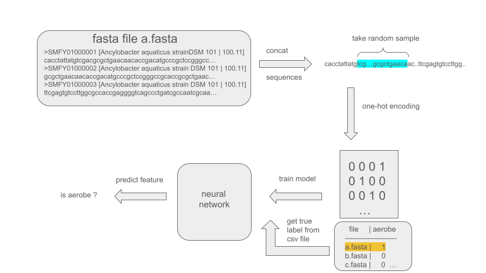
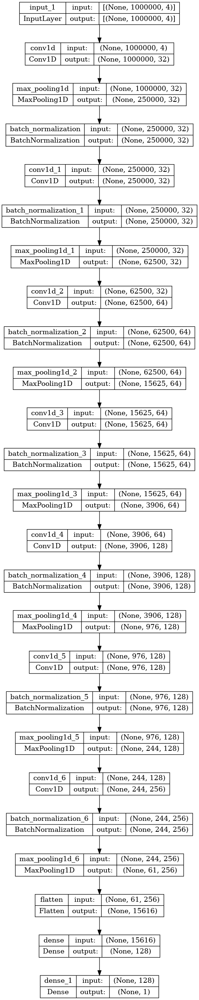
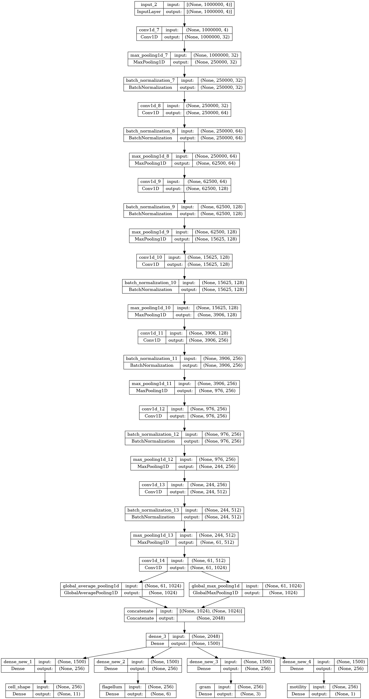

# BacDive phenotype prediction

To train a deep learning model for phenotype prediction, we take samples from fasta files and assign 
labels to the sequence based on a table with lable annotations.  

# Model architectures

Summary of a model architecture for spore training:

We use very similar architectures for cell size, pathogenicity and oxygen requirements training.
Depending on the task, we have to adjust the loss function and activation of the output layer.

Models can also have multiple output layers, i.e. the model tries to predict several features at once.
For the morphology prediction, the model predicts cell shape, flagellum, gram staining and motility. 

